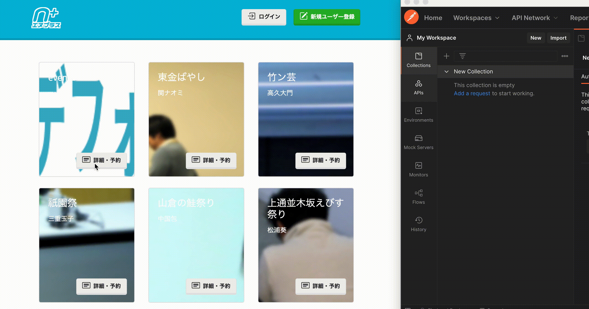
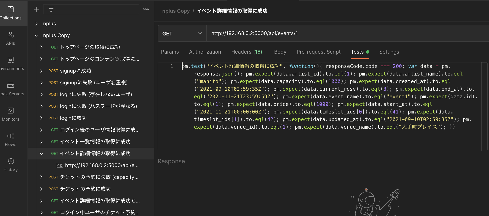

# postman-apitest-autogen


postman-apitest-autogen generate Postman collection included tests from Postman collection recorded request & response.

## Install

* download binary from [release](https://github.com/ShotaKitazawa/postman-apitest-autogen/releases)

## Usage

```
Usage of postman-apitest-autogen:
  -collection-file string
        filepath of postman_collection.json
  -filter-file string
        filepath of filter.json
  -output-file string
        filepath of output_collection.json (default "output.json")
  -version
        display version
```

## How to use

* run Postman proxy & setting HTTP proxy
    * ref. https://learning.postman.com/docs/sending-requests/capturing-request-data/capturing-http-requests/

* record request and response to test-target server by Postman proxy & export to `collection.json`



* (optional) create filter.json
    * can exclude specified fields from generate-test
    * `ignoreJSONPointer` format is [rfc6901](https://datatracker.ietf.org/doc/html/rfc6901)

```jsonnet
[
   {
      // exclude `.[0].created_at` in test title is "title01"
      "testname": "title01"
      "ignoreJSONPointer": "0.created_at",
   },
   {
      "testname": "title01"
      "ignoreJSONPointer": "1.created_at",
   }
]
```

* (optional, recommendation) create filter.json from jsonnet
    * because [rfc6901](https://datatracker.ietf.org/doc/html/rfc6901) cannot express wildcard.

```jsonnet
[
  {
    testname: 'title01',
    ignoreJSONPointer: '%d.created_at' % [i],
  }
  for i in std.range(0, 1)
]
```

* run postman-apitest-autogen & import `output.json` to Postman
    * if filter format is jsonnet, replace to `-filter-file <(jsonnet filter.jsonnet)`

```
postman-apitest-autogen -collection-file collection.json -filter-file filter.json -output-file output.json
```

* tests are generated!


